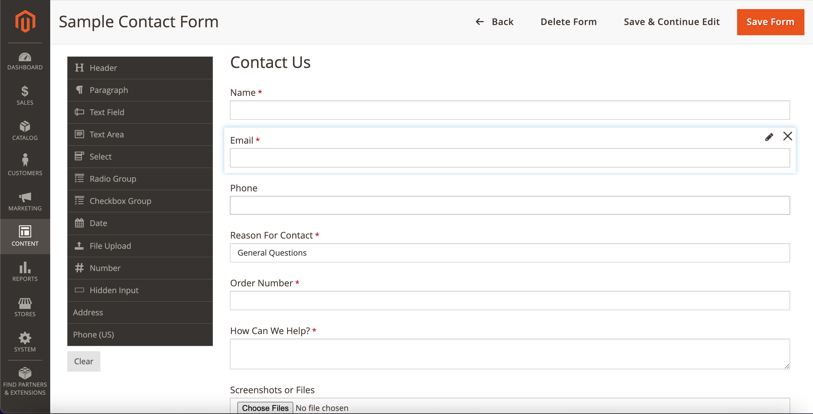
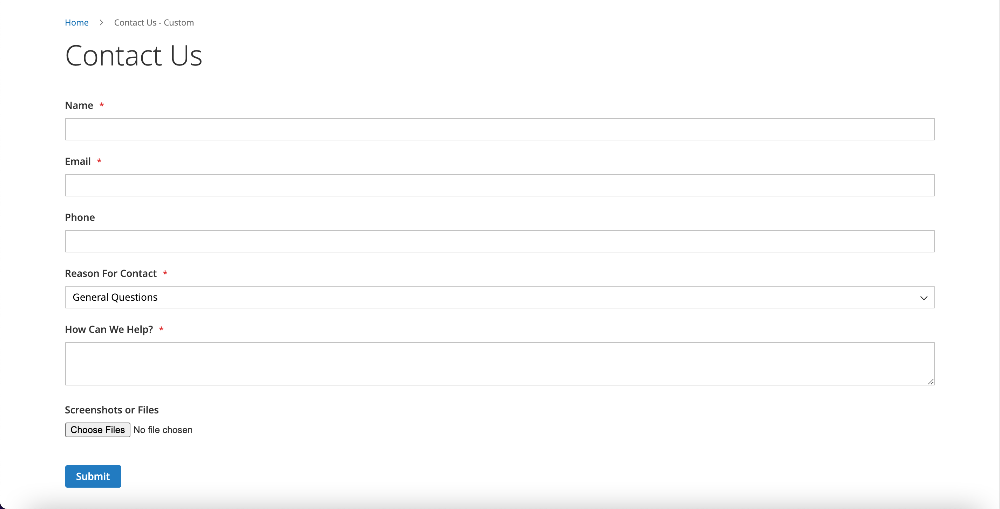

# Magento 2 Custom Forms

## Module Overview
This Magento 2 module provides a flexible admin user interface for creating custom
and rendering forms in Magento.

## Features
- Admin UI for building custom forms
    - Form builder can be customized with new fields
    - Field types:
        - Paragraph / Header 
            - Renders static text / heading elements
        - Text
            - Email,  password, telephone
        - Textarea
        - Select
        - Radio
        - Checkbox
        - Date
            - Magento datepicker widget enabled
        - File upload
        - Number
        - Hidden
        - Address
            - Renders an address fieldset included Street, City, Zipcode, Region, County
            - This address set utilizes the magento `regionUpdater` widget to handle populating
            and toggling the address region / country options
        - Phone (US)
            - Text field that implements a jQuery mask to render a US phone formatted
            text input 
- Rendered forms are unopinionated in their styles and are generated based 
on Magento core styling
- Store View / Customer Group filtering
- Email Notifications
    - Admin notifications for new submissions
    - Customer confirmation emails for submitted forms
    - Submitted files can be attached to the dispatched emails
- ReCaptcha enabled forms
- Admin UI Listings
    - Form Listing
    - Form Submission Listing
    - Form Submission Files Listing
        - UI Grid displaying all submitted files that can be downloaded

## Installation
```
composer require happymachines/magento2-module-custom-forms
bin/magento module:enable HappyMachines_CustomForms
bin/magento setup:upgrade
```

## Managing Forms
Forms can be created through the admin panel by navigating to **Content > Forms > Manage Forms**



Once rendered and embedded in a page you should see your form.


## Todo
Features to be added or further improved.

- Form ajax submission
- Addition form layouts / templates
    - Popup forms
    - Multistep forms
- Custom form success page
    - Form submission would redirect to the custom page
- Form Fields
    - Date
        - Add time option
        - Add min/max option
- Improve form conditions component
    - Add additional form comparison operators (less / greater than, includes / not-includes)
    - Add validation
- Form import / export
    - Import forms via csv or xml
    - Export forms and form submissions
- Form GDPR settings
    - Remove form submissions based on cron
- Form Setting to redirect to 404 if not available for current store or customer group
    - Would need a whitelist so 404s do not occur on critical pages ie homepage, accounts, etc
- Generate submission PDF
- Add a Customer account interface for viewing submitted forms
